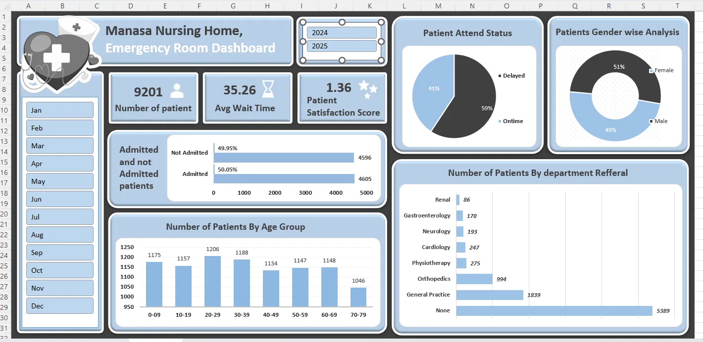

# 🏥 Hospital ER Patient Analysis

An end-to-end Emergency Room patient analytics dashboard built in **Excel Power Query + Power Pivot**, analyzing two years of ER visits for Manasa Nursing Home, a fictional Karnataka-based hospital adapted from a standard "Hospital Emergency Room Patients" analysis template for local, native context (patient names, community/religion field, and hospital branding localized to Karnataka).



---

## 📌 Purpose

We need to create a Hospital Emergency Room Analysis Dashboard to improve efficiency and provide useful insights, helping stakeholders monitor, analyze, and make better decisions for managing patients and improving services.

Full detail: [`docs/02_purpose_of_project.md`](docs/02_purpose_of_project.md)

---

## 🛠️ Tools Used

- **Microsoft Excel** — Power Query (ETL/data cleaning), Power Pivot (data modeling), DAX (calculated columns & measures)
- **GitHub** — version control & project documentation

---

## 🔁 Project Workflow

Executed as a structured pipeline from requirement gathering through to insight generation. Full breakdown: [`docs/01_project_steps.md`](docs/01_project_steps.md)

Business Requirement Gathering → Understanding of Data → Data Connection (Power Query) → Data Cleaning & Quality Check → Creating Calendar Table → Data Modeling (Power Pivot) → Adding Required Columns (DAX) → Creating Pivots & Dashboard Layout → Charts Development & Formatting → Dashboard/Report Development → Insights Generation.

---

## 📋 KPIs & Charts

- **Number of Patients**, **Average Wait Time**, and **Patient Satisfaction Score** — each as a card with a daily area sparkline. Full spec: [`docs/03_kpi_requirements.md`](docs/03_kpi_requirements.md)
- **Charts:** Patient Admission Status, Patient Age Distribution, Timeliness (% seen within 30 min), Gender Analysis, Department Referrals. Full spec: [`docs/04_charts_to_create.md`](docs/04_charts_to_create.md)

---

## 🧮 Data Modeling — Calendar Table & DAX

- Calendar table formula (Power Query): [`docs/05_calendar_table_formula.md`](docs/05_calendar_table_formula.md)
- Age Group, Patient Attend Status, and all core measures (DAX): [`docs/06_dax_formulas.md`](docs/06_dax_formulas.md)
- Data cleaning steps (Power Query): [`docs/07_data_cleaning.md`](docs/07_data_cleaning.md)

---

## 🗂️ Repository Structure

```
hospital-er-patient-analysis/
├── README.md
├── dashboard/
│   └── Hospital_Emergency_Room_Patients_Analysis.xlsx   # Power Query + Power Pivot + Dashboard
├── data/
│   └── raw/
│       └── Manasa_Nursing_Home_ER_Uncleaned.csv          # Original, uncleaned export
└── docs/
    ├── 01_project_steps.md
    ├── 02_purpose_of_project.md
    ├── 03_kpi_requirements.md
    ├── 04_charts_to_create.md
    ├── 05_calendar_table_formula.md
    ├── 06_dax_formulas.md
    ├── 07_data_cleaning.md
    └── screenshots/
        └── dashboard.png                                  # Final dashboard result
```

---

## 💡 Key Insights

- **Timeliness is a major operational gap.** A large share of patients wait longer than the 30-minute target, making this the most actionable metric in the dashboard.
- **Admissions are close to an even split** between admitted and not-admitted patients.
- **Department referral volume is heavily skewed** toward General Practice and Orthopedics, with a large portion of ER visits having no specialist referral at all — pointing to a mix of low- and high-acuity cases sharing the same queue.
- **Patient satisfaction scores are only captured for a subset of visits**, which limits how far that KPI can be trusted until survey coverage improves.
- **Patient demographics are broad, not concentrated** — a fairly even gender split and a spread-out age distribution mean improvements need to be system-wide rather than aimed at one group.

---

## 🚀 Recommendations for the Hospital

1. **Introduce a fast-track / low-acuity lane** for no-referral visits so they don't compete with urgent, referral-bound cases for the same queue slots — the highest-leverage fix for wait-time delays.
2. **Set and track a weekly "% seen within 30 minutes" target**, drilling into which days/shifts drive delays.
3. **Expand patient satisfaction survey capture** so the KPI reflects the full patient base, not a partial sample.
4. **Review service quality in the highest-volume/highest-acuity referral departments** first, since small improvements there affect the most patients.
5. **Treat wait-time reduction as a direct lever for satisfaction**, given the two are closely linked in the data.

## 🔧 Possible Extensions to This Project

- Add a rolling 7-day average trend line for wait time and satisfaction to smooth daily noise.
- Add a "Satisfaction Response Rate" KPI card so viewers can see how much of the satisfaction number is backed by actual responses vs. missing data.
- Add drill-through from the department referral chart to a patient-level detail table.
- Add an hour-of-day / day-of-week heatmap to support shift staffing decisions.

---

## 👤 Author

**Swasthik K P**
📧 kpswasthik2004@gmail.com · [LinkedIn](https://linkedin.com/in/swasthik-k-p-7b927b377) · [GitHub](https://github.com/Swasthikkp)

*Note: This project uses a synthetic dataset localized with Karnataka-context names, community/religion fields, and hospital branding for portfolio purposes. It does not represent a real patient population or real hospital.*
